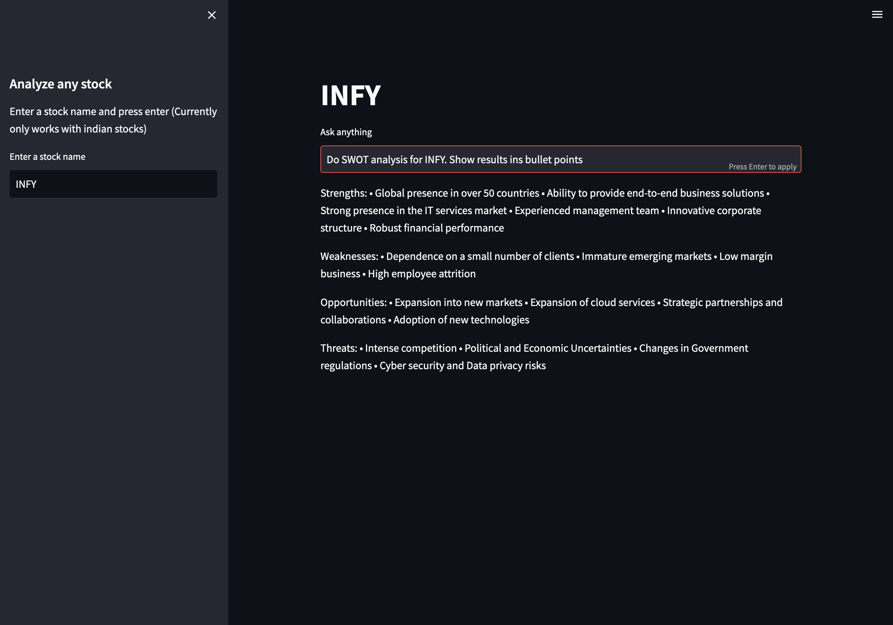

# Stock Research Assistant

Langchain stock market research assistant



## How to run

1. Make a copy of .env.example file as .env and popualte the environment variables

2. Install the dependencies

   ```bash
   # install dependencies
   poetry install
   ```

3. Open app.py and change the symbol

   ```python
   # note: the assistant currently only support indian indices
   symbol = 'SYMBOL'
   ```

4. Run the following command to start the app

   ```bash
   # run the app
   streamlit run app.py
   ```

5. It should be noted that initial load will take some time and consecuteive load should be much faster

## TODO

1. Source data cleanup
2. Create REST Api
3. Index data for faster retrieval
